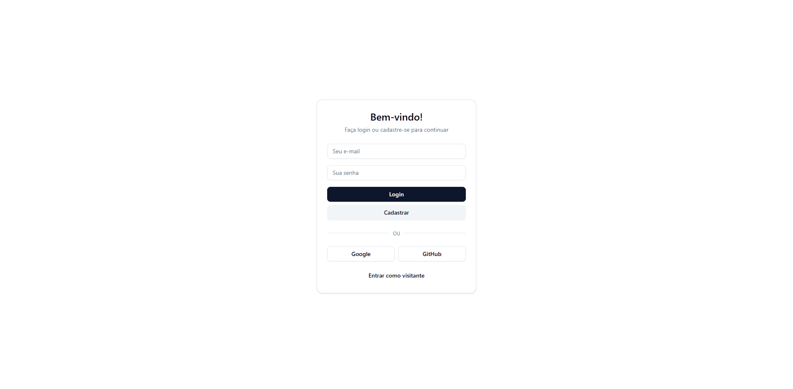

# To-Do List com React e Supabase



<p align="center">
  
  
  
  
  
  
</p>

## 🚀 Sobre o Projeto

Este é um projeto de To-Do List completo, desenvolvido como um portfólio para demonstrar competências em tecnologias front-end modernas. A aplicação permite que os utilizadores se registem, façam login e gerenciem as suas próprias listas de tarefas, com todos os dados persistidos de forma segura na nuvem através do Supabase.

O projeto foi construído do zero, passando por uma refatoração completa de uma base de Create React App com `styled-components` para uma stack moderna com **Vite**, **TypeScript**, **Tailwind CSS** e **shadcn/ui**.

🔗 **Veja a aplicação ao vivo:**(https://todolist-45a.pages.dev/)

---

## ✨ Funcionalidades Principais

* **Autenticação Completa:** Sistema de login e cadastro com e-mail e senha.
* **Login Social (OAuth):** Integração com provedores como **Google** e **GitHub**.
* **Segurança com RLS:** As políticas de segurança do Supabase garantem que cada utilizador só possa aceder às suas próprias tarefas.
* **Modo Visitante:** Permite que os utilizadores testem a aplicação sem criar uma conta, com os dados guardados localmente (`localStorage`).
* **CRUD de Tarefas:** Funcionalidades completas para Criar, Ler, Atualizar (editar) e Apagar tarefas.
* **Gestão de Estado:** Tarefas podem ser marcadas como concluídas e movidas para uma secção separada.
* **UI Moderna e Responsiva:** Interface construída com `shadcn/ui` e Tailwind CSS, totalmente adaptável a dispositivos móveis e desktops.

---

## 🛠️ Tecnologias Utilizadas

Este projeto foi construído com o objetivo de aplicar as tecnologias listadas na vaga de estágio, demonstrando familiaridade e experiência prática com:

* **Front-End:**
    * **React com TypeScript:** Para uma base de código robusta e tipada.
    * **Vite:** Como ferramenta de build e servidor de desenvolvimento ultra-rápido.
    * **Tailwind CSS:** Para estilização utilitária e eficiente.
    * **shadcn/ui:** Para componentes de UI acessíveis, reutilizáveis e customizáveis.

* **Back-End (BaaS):**
    * **Supabase:** Utilizado como a solução de backend completa, incluindo:
        * **Supabase Auth:** Para gestão de utilizadores e autenticação.
        * **Supabase Database:** Banco de dados PostgreSQL para persistir as tarefas.
        * **Row Level Security (RLS):** Para garantir a segurança e a privacidade dos dados.

* **Deployment:**
    * **Cloudflare Pages:** Para deploy contínuo, rápido e global a partir do Git.

---

## 🏁 Como Executar o Projeto Localmente

Siga os passos abaixo para configurar e executar a aplicação na sua máquina.

### Pré-requisitos

* [Node.js](https://nodejs.org/en/) (versão LTS recomendada)
* [Git](https://git-scm.com/)

### Passos

1.  **Clone o repositório:**
    ```bash
    git clone [https://github.com/seu-usuario/ToDoList.git](https://github.com/seu-usuario/ToDoList.git)
    ```

2.  **Navegue para a pasta do projeto:**
    ```bash
    cd ToDoList
    ```

3.  **Instale as dependências:**
    ```bash
    npm install
    ```

4.  **Configure as variáveis de ambiente:**
    * Crie um ficheiro chamado `.env.local` na raiz do projeto.
    * Adicione as suas chaves do Supabase a este ficheiro:
        ```
        VITE_SUPABASE_URL=SUA_URL_DO_PROJETO_SUPABASE
        VITE_SUPABASE_ANON_KEY=SUA_CHAVE_ANON_PUBLICA_SUPABASE
        ```

5.  **Inicie o servidor de desenvolvimento:**
    ```bash
    npm run dev
    ```

A aplicação estará disponível em `http://localhost:5173`.

---

## 📧 Contacto

**Victor Leandro**

* **Email:** victor2lra@gmail.com
* **LinkedIn:** [https://www.linkedin.com/in/seu-perfil/](https://www.linkedin.com/in/victorleandro/)
* **GitHub:** [@Afrontoso](https://github.com/Afrontoso)
