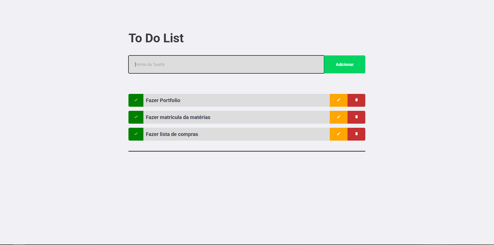

# ToDoList - Gerenciador de Tarefas com React

Este é um projeto de uma aplicação de lista de tarefas (To-Do List) desenvolvida como parte do processo de trainee da empresa júnior de Engenharia de Software, Orc'estra. A aplicação foi construída utilizando React para criar uma interface de usuário interativa e eficiente para o gerenciamento de tarefas diárias.

**[Acesse a versão ao vivo aqui!](to-do-afrontoso.vercel.app)**



## 🚀 Sobre o Projeto

O objetivo deste projeto é demonstrar a aplicação de conceitos fundamentais do desenvolvimento front-end com React. A aplicação permite que os usuários adicionem, concluam e removam tarefas, oferecendo uma experiência de usuário simples e direta. Este projeto serve como uma demonstração das minhas habilidades em criar componentes reutilizáveis, gerenciar o estado da aplicação e interagir com o DOM de forma declarativa.

## ✨ Funcionalidades

- **Adicionar Tarefas:** Campo de entrada para adicionar novas tarefas à lista.
- **Marcar como Concluída:** Funcionalidade para marcar e desmarcar tarefas como concluídas.
- **Remover Tarefas:** Opção para excluir tarefas da lista.

## 🛠️ Tecnologias Utilizadas

O projeto foi desenvolvido utilizando as seguintes tecnologias:

- **[React](https://reactjs.org/):** Biblioteca JavaScript para a construção de interfaces de usuário.
- **HTML5:** Linguagem de marcação para a estrutura da página.
- **CSS3:** Linguagem de estilização para o design da aplicação.
- **JavaScript (ES6+):** Linguagem de programação para a lógica da aplicação.
- **npm:** Gerenciador de pacotes do Node.js.

## ⚙️ Como Executar o Projeto

Para executar este projeto localmente, siga os passos abaixo:

1.  **Clone o repositório:**
    ```bash
    git clone [https://github.com/Afrontoso/ToDoList.git](https://github.com/Afrontoso/ToDoList.git)
    ```

2.  **Acesse o diretório do projeto:**
    ```bash
    cd ToDoList
    ```

3.  **Instale as dependências:**
    ```bash
    npm install
    ```

4.  **Inicie a aplicação:**
    ```bash
    npm start
    ```

5.  **Acesse a aplicação:**
    Abra seu navegador e acesse `http://localhost:3000` para ver a aplicação em funcionamento.

## 👨‍💻 Autor

Feito com dedicação por **Victor Leandro**.

- **LinkedIn:** [Victor Leandro](https://www.linkedin.com/in/victorleandro/)
- **GitHub:** [@Afrontoso](https://github.com/Afrontoso)